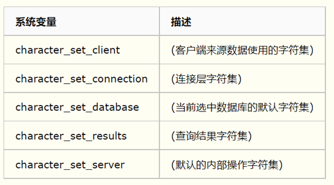
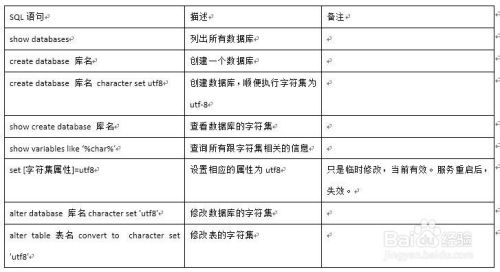

# 1、MySQL 5.7

参考：[3、安装MySQL详细说明_哔哩哔哩_bilibili](https://www.bilibili.com/video/BV1NJ411J79W?p=3&vd_source=722193c70cdbe110ff1c12577ed94c0f)


1. 下载并解压到安装目录；

2. 添加环境变量；

   1. 打开环境变量；
   2. 选择PATH，添加mysql安装文件下的bin目录；
   3. 比如：`D:\Java\Mysql\mysql-5.7.19-winx64\bin`

3. 在目录`D:\Java\Mysql\mysql-5.7.19-winx64`下新建my.ini文件；

4. 编辑my.ini，写入如下内容，此时会跳过密码验证（第5行）；

   1. ```ini
      [mysqld]
      basedir=D:\Java\Mysql\mysql-5.7.19-winx64\
      datadir=D:\Java\Mysql\mysql-5.7.19-winx64\data\
      port=3306
      skip-grant-tables
      collation-server = utf8_unicode_ci
      init-connect='SET NAMES utf8'
      character-set-server = utf8
      
      [client]
      default-character-set=utf8
      
      [mysql]
      default-character-set=utf8
      
      [mysql.server]
      default-character-set=utf8
      
      [mysql_safe]
      default-character-set=utf8
      
      #basedir表示mysql安装路径
      #datadir表示mysql数据文件存储路径
      #port表示mysql端口
      #skip-grant-tables表示忽略密码
      #起飞 芜湖
      ```

5. 启动管理员模式下的CMD，并将路径切换到mysql安装目录下的bin目录（cd /d），然后输入`mysqld -install`（安装mysql）;

6. 显示 Service successfully installed；

7. 再输入 `mysqld --initialize-insecure  --user=mysql`;

8. mysql安装目录下多了一个data目录，且没有报错；

9. 再次启动mysql，使用命令`net start mysql`；

10. 然后用命令`mysql -u root -p` 进入Mysql管理界面，此时密码为空，直接回车，再回车；

11. 进入界面后更改root密码：

    1. ```sql
       update mysql.user set authentication_string=password('123456') where user='root' and Host='localhost';
       ```

12. 然后输入 `flush privileges`，刷新权限；

13. 修改my.ini文件中跳过密码部分，即注释第5行；

14. 退出mysql ，exit；

15. 重启MySQL即可正常使用了；

    1. ```cmd
       net stop mysql
       net start mysql
       ```

16. 连接到MySQL `mysql -u root -p`；


# 2、关于mysql的参考资料

- MySQL5.7.19免安装版的安装与卸载重装：https://blog.csdn.net/Mrqiang9001/article/details/78070297
- 狂神：https://space.bilibili.com/95256449/channel/detail?cid=146244
- MySQL怎样修改字符集：https://jingyan.baidu.com/article/acf728fdfb1f31b8e410a373.html
- 查看MYSQL数据库服务器和数据库字符集：https://www.cnblogs.com/antball/p/9831284.html
- mysql字符集编码设置与查看命令：https://blog.csdn.net/shandongmachao/article/details/52767318
- show variables like '%character%';
- show variables like 'collation%';
- SET NAMES 'utf8';






# 3、MySQL官方网站

- 下载页面：[MySQL :: MySQL Downloads](https://www.mysql.com/cn/downloads/)；
- 选择最下面的 MySQL Community (GPL) Downloads »；
- 点击：[MySQL Community Server](https://dev.mysql.com/downloads/mysql/)

# 4、MySQL8.0

- [MySQL8免安装版下载安装与配置(windows)_pingcode的博客-CSDN博客_mysql8下载](https://blog.csdn.net/qq_41521682/article/details/122666842)

此版本安装步骤与MySQL5.7有所不同。

1. 下载压缩包并解压到对应目录；

2. 添加bin目录到环境变量；

3. 使用管理员身份，运行命令 `mysqld --install`，提示服务安装成功；

4. 如需卸载MySQL服务，运行`mysqld --remove`命令，提示服务移除成功；

5. 在根目录中新建my.ini文件，编辑并写入如下内容：

   1. ```ini
      [mysqld]
      basedir=D:\Java\Mysql\mysql-5.7.19-winx64\
      datadir=D:\Java\Mysql\mysql-5.7.19-winx64\data\
      
      bind-address=0.0.0.0
      port=3306
      default-storage-engine=INNODB
      character-set-server = utf8mb4
      
      [client]
      default-character-set=utf8mb4
      
      [mysql]
      default-character-set=utf8mb4
      
      [mysql.server]
      default-character-set=utf8mb4
      
      [mysql_safe]
      default-character-set=utf8mb4
      ```

6. 执行 `mysqld --initialize --console`，会随机生成初始密码，"root@localhost:"后面的即为初始密码，记录下来，之后登录要用。如果这一步执行出错要先删除data文件夹再执行后面的操作；

7. 命令执行完会生成data文件夹；

8. 以管理员身份运行命令提示符，执行`net start mysql`启动MySQL服务；

9. 输入`mysql -u root -p`进入mysql，需要用到上面的随机密码；

10. 修改root用户密码

    1. ```sql
       alter user 'root'@'localhost' identified by '123456';
       ```

11. 刷新权限 `flush privileges`。

12. 成功！！！


注：过程3可能会报如下系统错误，此错误与MySQL8无关，将缺失的文件`vcruntime140_1.dll`复制到C:\Windows\System32目录下（32位操作系统需复制到C:\Windows\SysWOW64）即可解决。`vcruntime140_1.dll`下载地址：[vcruntime140_1.dll](https://download.csdn.net/download/qq_41521682/75268001).

卸载：

1. net stop mysql；
2. 删除Mysql的注册表，win+R搜索regedit，删除：HKEY_LOCAL_MACHINE\SYSTEM\ControlSet001\Services\Eventlog\Application\MySQL
3. 将 HKEY_LOCAL_MACHINE\SYSTEM\ControlSet001\Services\EventLog\Application\MySQL 中的 下面两个文件；
4. 移除Mysql服务，mysqld -remove
4. 不确定要不要用这个 sc delete MySQL；
5. 删除Mysql文件。

